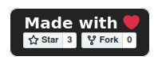
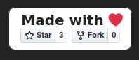

# RepoPromotion
A frontend page that displays the star and fork options by the repository.

 

## Compatibility

- Dark Mode
   

 

- Light Mode
   

 

- Language
  - English(Standard)
  - Português/Brasil
    - just change the root index.html by what is in the ./pt-Br/index.html directory 
    - basta alterar o index.html raiz pelo que está no diretório ./pt-Br/index.html 